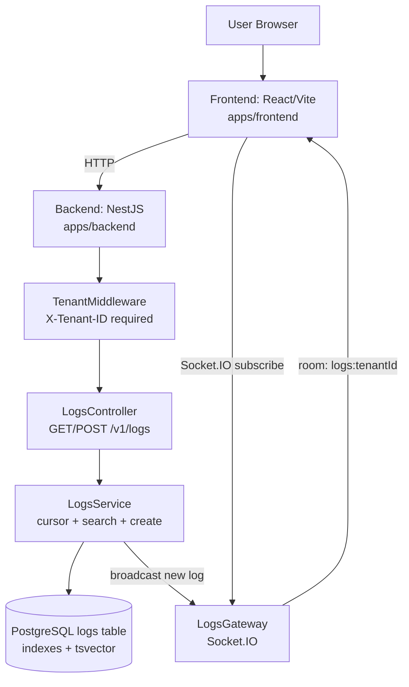

# LogStream API Monorepo
A multi-tenant log ingestion and viewing system with cursor-based pagination, full-text search, and real-time Socket.IO streaming.

## Problem Statement
Teams need to inspect large volumes of logs without:
- leaking data across tenants,
- degrading performance with `OFFSET` pagination,
- waiting for manual refresh to see new logs.

## Solution Overview
This repository implements a full-stack log dashboard:
- **Backend (`apps/backend`)**: NestJS + PostgreSQL (TypeORM) API with tenant isolation, cursor pagination, and Socket.IO broadcast.
- **Frontend (`apps/frontend`)**: React + Vite dashboard with tenant selector, filters, infinite scroll, and live updates.
- **Docker orchestration**: PostgreSQL, backend, seed job, and frontend.

## Key Features
- Mandatory tenant scoping via `X-Tenant-ID` middleware.
- Standard API envelope for success/error responses.
- Cursor pagination (`timestamp,id`) for stable, scalable reads.
- Full-text search with PostgreSQL `tsvector` + GIN index.
- Real-time streaming via Socket.IO room isolation per tenant.
- Frontend infinite query + IntersectionObserver pagination.
- Seed script for high-volume synthetic tenant data.

## Tech Stack
| Layer | Technology |
|---|---|
| Backend API | NestJS 10, TypeScript, TypeORM |
| Database | PostgreSQL 15 |
| Realtime | Socket.IO |
| Validation | Zod |
| Frontend | React 19, Vite 5, Tailwind CSS, Zustand |
| Data Fetching | TanStack React Query, Axios |
| Containerization | Docker, Docker Compose |

## Architecture Overview


## API Quick Reference
| Method | Path / Event | Auth | Purpose |
|---|---|---|---|
| GET | `/health` | Public (no tenant header required) | Service health probe |
| GET | `/v1/logs` | `X-Tenant-ID` required | Fetch tenant logs with cursor pagination + filters |
| POST | `/v1/logs` | `X-Tenant-ID` required | Create a log and trigger realtime broadcast |
| WS event | `subscribe` | No auth middleware; client sends `tenantId` | Join tenant room and optional severity filter |
| WS event | `unsubscribe` | No auth middleware; client sends `tenantId` | Leave tenant room |
| WS event | `log` | Server push | Receive new log entries |

## Request/Response Examples
### Create log
```http
POST /v1/logs
X-Tenant-ID: tenant_a
Content-Type: application/json

{
  "severity": "ERROR",
  "source": "auth-service",
  "message": "Authentication failed for user john@example.com",
  "metadata": { "requestId": "req_123" }
}
```

```json
{
  "success": true,
  "data": {
    "id": "f2cf7a9b-7c3d-4f95-8c15-0cb1bc2ef0f2",
    "tenantId": "tenant_a",
    "timestamp": "2026-04-05T10:15:30.123Z",
    "severity": "ERROR",
    "source": "auth-service",
    "message": "Authentication failed for user john@example.com",
    "metadata": { "requestId": "req_123" }
  },
  "meta": {
    "requestId": "ad0e6c32-6dd4-4d21-9a9f-9f53de3d0b66",
    "timestamp": "2026-04-05T10:15:30.130Z"
  }
}
```

### Fetch logs with filters + cursor
```http
GET /v1/logs?limit=50&severity=ERROR&searchTerm=authentication&cursor=<base64url>
X-Tenant-ID: tenant_a
```

```json
{
  "success": true,
  "data": {
    "items": [
      {
        "id": "...",
        "tenantId": "tenant_a",
        "timestamp": "2026-04-05T10:12:00.000Z",
        "severity": "ERROR",
        "source": "auth-service",
        "message": "Authentication failed",
        "metadata": null
      }
    ],
    "nextCursor": "eyJ0aW1lc3RhbXAiOiIyMDI2LTA0LTA1VDEwOjEyOjAwLjAwMFoiLCJpZCI6Ii4uLiJ9",
    "hasMore": true
  },
  "meta": {
    "requestId": "...",
    "timestamp": "2026-04-05T10:12:01.000Z"
  }
}
```

### Missing tenant header error
```json
{
  "success": false,
  "error": {
    "code": "MISSING_TENANT_ID",
    "message": "X-Tenant-ID header is required for tenant-scoped API routes"
  },
  "meta": {
    "requestId": "...",
    "timestamp": "2026-04-05T10:16:00.000Z"
  }
}
```

## Error Handling / Status Codes
| Status | Error Code (typical) | When |
|---|---|---|
| 200 | n/a | Successful reads (`GET /health`, `GET /v1/logs`) |
| 201 | n/a | Successful log creation (`POST /v1/logs`) |
| 400 | `MISSING_TENANT_ID` | Missing/empty `X-Tenant-ID` |
| 400 | `VALIDATION_ERROR` | Invalid query/body schema |
| 500 | `INTERNAL_ERROR` | Unhandled server error |

## Setup and Run
### Docker (full stack)
```bash
# from repo root
docker compose up --build
```

Services (default):
- Frontend: `http://localhost:5173`
- Backend: `http://localhost:3000`
- PostgreSQL host port: `5433` (container internal `5432`)

Seed additional data:
```bash
docker compose run --rm seed
```

Hot-reload frontend override:
```bash
docker compose -f docker-compose.yml -f docker-compose.dev.yml up --build
```

### Local (without full Docker app stack)
1. Start PostgreSQL (local install or Docker).
2. Backend:
```bash
cd apps/backend
npm install
npm run migration:run
npm run start:dev
```
3. Frontend:
```bash
cd apps/frontend
npm install
npm run dev
```

## Env / Config
### Root `.env.example`
- `POSTGRES_DB`, `POSTGRES_USER`, `POSTGRES_PASSWORD`
- `DATABASE_URL` (present but not consumed by current backend runtime config)
- `NODE_ENV`, `PORT`

### Backend uses
- `DB_HOST`, `DB_PORT`, `DB_USERNAME`, `DB_PASSWORD`, `DB_DATABASE`, optional `DB_SSL`
- `FRONTEND_URL` for CORS

### Frontend uses
- `VITE_API_URL` (build-time for Docker image, dev-time for Vite)

**Assumption:** For local backend + Docker Postgres, set `DB_PORT=5433` because `docker-compose.yml` maps host `5433 -> container 5432`.

## Test Commands
Backend:
```bash
cd apps/backend
npm test
npm run test:e2e
npm run test:cov
```

Frontend:
```bash
cd apps/frontend
npm run lint
npm run build
```

## Quick Usage Flow
1. Start stack (`docker compose up --build`) or run backend/frontend locally.
2. Open frontend at `http://localhost:5173`.
3. Select a tenant (`tenant_a`, `tenant_b`, `tenant_c`).
4. Filter by severity and/or search term (3+ chars).
5. Scroll table to trigger cursor-based loading.
6. Create logs via `POST /v1/logs` and observe live updates in subscribed tenant view.

## Known Limitations
- WebSocket `subscribe` currently trusts client-provided `tenantId`; no authenticated identity mapping in gateway yet.
- `DATABASE_URL` exists in `.env.example` but backend connection code uses split DB vars.
- No frontend automated tests found in repository.
- No root-level workspace scripts; backend/frontend commands run per app directory.

## Roadmap / Next Improvements
1. Add auth on HTTP and Socket.IO, enforce tenant claims server-side.
2. Add request ID middleware and propagate `req.id` consistently.
3. Add frontend tests (component + integration) and CI pipeline.
4. Add rate limiting and payload guards on log ingestion.
5. Add production observability (structured logs, metrics, tracing).

